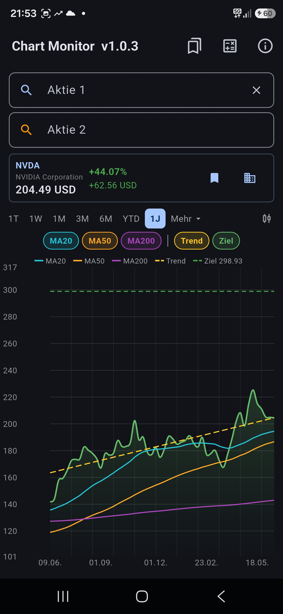
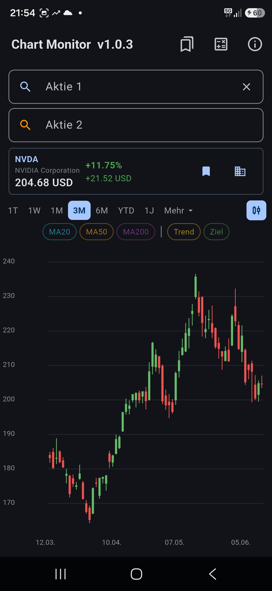
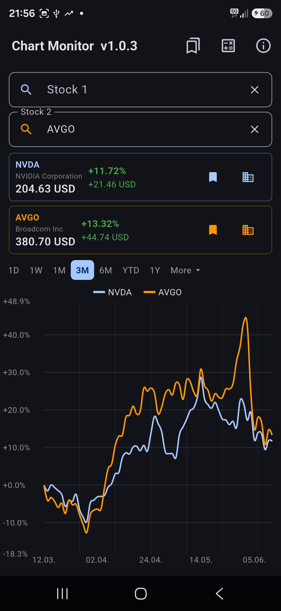
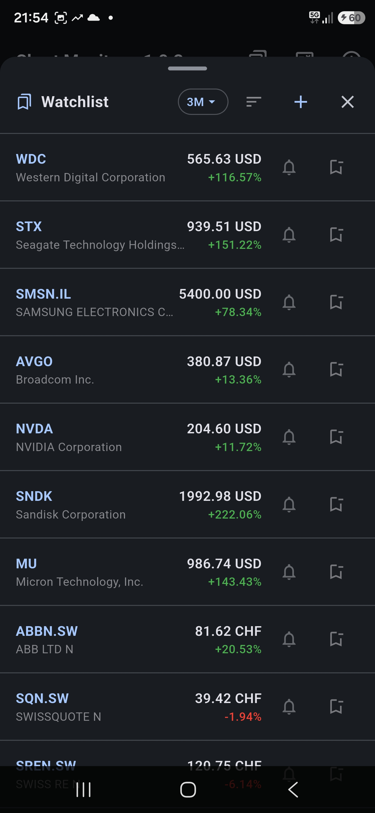
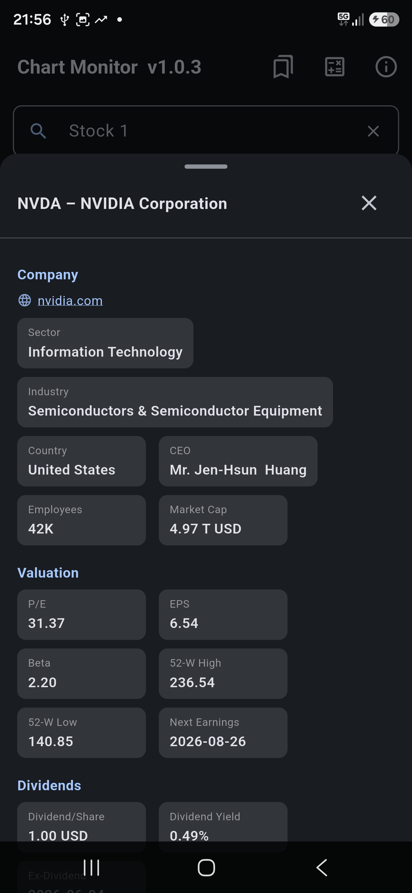
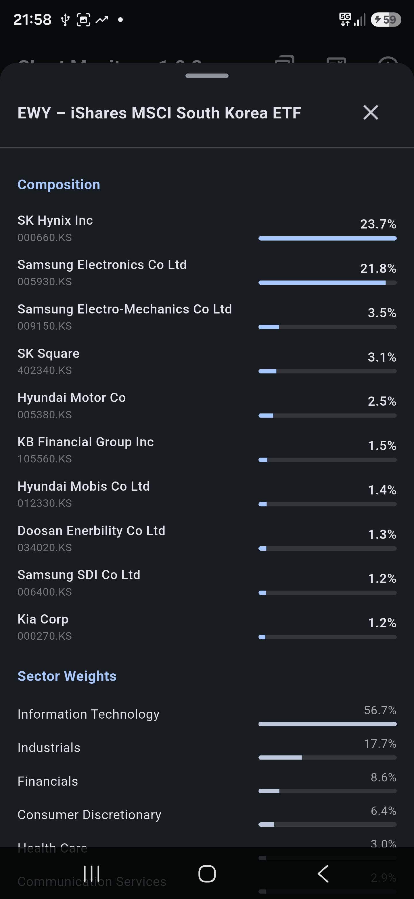

# Chart Monitor

**Stock chart app for Android** – Compare stocks, analyze with technical indicators, track your watchlist with price alerts.

  
  
  

  
  
  

  
  

---

## Features

### Charts
- **Line chart** and **candlestick chart** (switchable per stock)
- **Two-stock comparison** with percentage-normalized overlay
- **Time ranges**: 1D · 1W · 1M · 3M · 6M · YTD · 1Y · 2Y · 5Y · Max · Custom date range
- **Interactive tooltip** – tap or drag to see exact price and date

### Technical Indicators
- **MA20** – 20-day moving average (cyan)
- **MA50** – 50-day moving average (orange)
- **MA200** – 200-day moving average (pink) – available on all time ranges including 1Y and 2Y
- **Trend line** – linear regression from chart start to end (yellow dashed)
- **Analyst target** – consensus price target line (green dashed)
- All indicator settings persist across app restarts

### Watchlist
- Add/remove stocks with one tap
- **Period performance** for each entry (1D / 1W / 1M / 3M / 6M / YTD / 1Y – switchable)
- **GICS sector badge** displayed per stock
- **Sort modes**: Manual · A–Z · Z–A · Best performance · Worst performance · GICS sector
- **Price alerts**: set Stop-Loss and/or Target price per stock
- **Background notifications** (WorkManager) – alerts fire even when the app is closed, during market hours (Mon–Fri 13:00–22:30 UTC)

### Stock Details Sheet
- Company info: sector, industry, country, CEO, employees, market cap
- Valuation: P/E, EPS, Beta, 52-week high/low, next earnings date
- Dividends: dividend per share, yield, ex-dividend date, annual dividend history chart
- Company description
- Latest news headlines (tap to open in browser)
- Direct link to company website

### ETF Details Sheet
- Top holdings with percentage bars
- Sector weighting breakdown

### FX Calculator
- Currency converter with live exchange rates
- Interest/compound interest calculator
- Last used tab persists across app restarts

### General
- **Dark theme**
- **Multilingual**: English and German
- **Full persistence**: last searched stock, chart range, all indicator states restore on relaunch
- Supports stocks, ETFs, and indices from global exchanges (Yahoo Finance)

---

## User Guide

### Getting started

1. Tap the **Stock 1** search field and type a company name or ticker symbol (e.g. `NVDA` or `Apple`)
2. Select a result from the dropdown
3. The chart loads automatically with the default range (1M)

### Switching time ranges

Tap **1D · 1W · 1M · 3M · 6M · YTD · 1Y** in the range bar, or tap **More** for 2Y, 5Y, Max, and custom date range.

### Toggling indicators

Tap **MA20**, **MA50**, **MA200**, **Trend**, or **Target** chips below the range bar to toggle each indicator on/off. Indicators that require more data than currently available are automatically disabled.

### Candlestick chart

Tap the candlestick icon (top right of the chart area) to switch between line and candlestick view. Available for all ranges except 1D.

### Comparing two stocks

Tap the **Stock 2** search field and search for a second stock. The chart switches to a percentage-normalized comparison view. Tap the **×** next to Stock 2 to remove it.

### Watchlist

Tap the **bookmark icon** (top right of the app bar) to open the watchlist.

- **Add a stock**: tap the bookmark icon on the stock price card in the main view
- **Set a price alert**: tap the bell icon on any watchlist entry, enter a Stop-Loss and/or Target price, and save. You will receive a push notification when the price crosses the threshold (notification permission required)
- **Change period**: tap the period chip (e.g. `3M`) in the watchlist header to switch the performance timeframe
- **Sort**: tap the sort icon in the watchlist header to choose a sort mode
- **Remove**: tap the bookmark icon again from the main view, or use the bookmark icon in the watchlist row

### Stock / ETF details

Tap the **grid icon** next to the bookmark on the stock price card to open the detail sheet. Scroll down to see valuation metrics, dividends, description, and news.

### FX Calculator

Tap the **calculator icon** in the app bar to open the FX calculator. Switch between the currency converter and the interest calculator using the tabs at the top.

---

## Technical

- Built with **Flutter** (Dart)
- Data: **Yahoo Finance** API (v8/v10) with 3-strategy auth fallback
- Background alerts: **WorkManager** (15-min periodic task, market hours only)
- Notifications: **flutter_local_notifications**
- Charts: **fl_chart**
- State management: **Provider** / `ChangeNotifier`
- Persistence: **SharedPreferences**

---

## Related

- [Stock Monitor](https://github.com/StockMonitorCH/stock-monitor) – Desktop stock monitoring app (Linux/Windows)

---

*Data provided by Yahoo Finance. For personal use only.*
